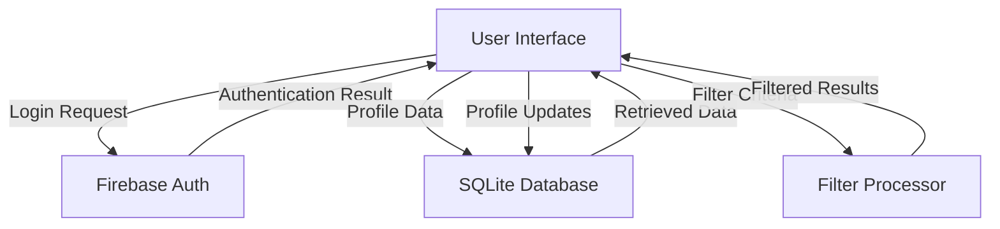

# TutorMatch Data Flow Diagram

### Description
1. **Firebase Auth**: Handles user authentication
2. **SQLite Database**: Stores and retrieves teacher profile data
3. **Filter Processor**: Processes filtering criteria for teacher search
4. **User Interface**: Main interaction point for all data operations
