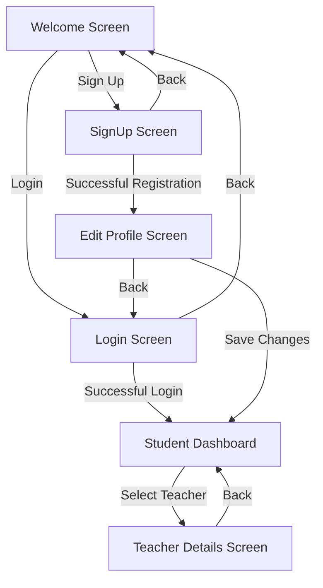

# TutorMatch User Flow Diagram

### Description
1. **Welcome Screen**: Entry point with options to login or sign up
2. **Login Screen**: Handles user authentication
3. **SignUp Screen**: New user registration
4. **Student Dashboard**: Main interface showing available teachers
5. **Teacher Details Screen**: Detailed view of selected teacher's profile
6. **Edit Profile Screen**: Allows teachers to update their profile information
